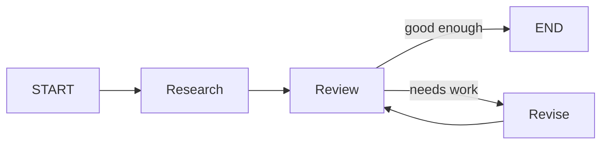

# Chapter 1: Why Agents Need Graphs

[Watch the visual lesson on YouTube](https://youtu.be/GWBM2Ueqp6o)

A normal Python chain follows one fixed path. An agent needs control flow that
can branch, loop, pause, and choose its next step at runtime. This chapter
introduces LangGraph's core mental model:

- **State** is the shared data moving through the workflow.
- **Nodes** are functions that read state and return partial updates.
- **Edges** decide which node runs next.
- **Conditional edges** turn runtime decisions into branches and loops.

No API key or model call is required.

## Visual model



The loop is data-driven: `Review` inspects the current state and the
conditional edge chooses the next hop at runtime.

## Examples

| File | What it demonstrates |
|---|---|
| [`01_the_problem.py`](code/01_the_problem.py) | Why a fixed sequence cannot route back to an earlier step |
| [`02_first_graph.py`](code/02_first_graph.py) | A minimal compiled `StateGraph` |
| [`03_loop_graph.py`](code/03_loop_graph.py) | A conditional edge that reviews and revises in a loop |

Run them in order:

```bash
python chapters/01-why-graphs/code/01_the_problem.py
python chapters/01-why-graphs/code/02_first_graph.py
python chapters/01-why-graphs/code/03_loop_graph.py
```

## Key pattern

```python
builder = StateGraph(State)
builder.add_node("research", research)
builder.add_node("review", review)
builder.add_edge(START, "research")
builder.add_edge("research", "review")
builder.add_edge("review", END)
graph = builder.compile()
```

The graph definition separates *what each step does* from *where execution
goes next*. Chapter 2 shows how state updates are merged when multiple nodes
write to the same key.
