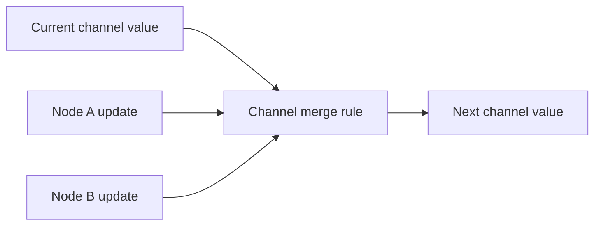

# Chapter 2: State, Channels, and Reducers

[Watch the visual lesson on YouTube](https://youtu.be/IfGZrTuZDNA)

Every key in a LangGraph state schema becomes a channel. A channel needs a rule
for combining its current value with each new update. The default rule keeps
the latest value; a reducer lets you define a different merge policy.

This chapter explains:

- why nodes return partial state updates;
- why mutating the input state is not the update protocol;
- how `Annotated` attaches a reducer to one channel;
- why parallel writes need an explicit merge rule;
- how `add_messages` appends new messages and replaces matching IDs; and
- how input, output, and internal schemas expose different views of state.

No API key or model call is required.

## Visual model



Without a reducer, a last-value channel can accept one update in a step. With a
reducer, the channel has an explicit rule for combining concurrent updates.

## Examples

| File | What it demonstrates |
|---|---|
| [`01_the_overwrite.py`](code/01_the_overwrite.py) | The default last-value behavior |
| [`02_patch_not_mutation.py`](code/02_patch_not_mutation.py) | A node's returned dictionary is its state update |
| [`03_channels.py`](code/03_channels.py) | Schema keys as channels |
| [`04_reducer.py`](code/04_reducer.py) | Merging lists with `operator.add` |
| [`05_custom_reducer.py`](code/05_custom_reducer.py) | A deduplicating, size-limited reducer |
| [`06_parallel_crash.py`](code/06_parallel_crash.py) | An intentional parallel-write failure |
| [`07_parallel_fixed.py`](code/07_parallel_fixed.py) | The same fan-out with a reducer |
| [`08_messages.py`](code/08_messages.py) | `add_messages`: append and replace by ID |
| [`09_schemas.py`](code/09_schemas.py) | Separate input, output, and internal schemas |

Run one example:

```bash
python chapters/02-state-and-reducers/code/04_reducer.py
```

Or run the full verified sequence from the repository root:

```bash
python run_examples.py
```

## Reducer pattern

```python
import operator
from typing import Annotated, TypedDict


class State(TypedDict):
    topic: str
    notes: Annotated[list[str], operator.add]
```

The annotation changes the merge rule for `notes`; it does not change the node
functions or graph edges.
