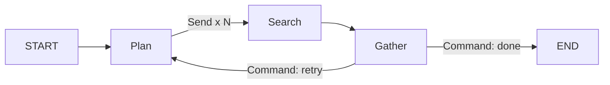

# Chapter 3: Nodes, Edges, Command, and Send

[Watch the visual lesson on YouTube](https://youtu.be/gSKfgMQSTM4)

Chapter 2 defined how state updates merge. This chapter defines how execution
moves through the graph. In LangGraph, an edge records control flow; it does not
execute a step when `add_edge` is called.

This chapter explains:

- why edge declaration order does not determine execution order;
- how `START` and `END` participate in the compiled graph;
- how a conditional edge maps a router's key to a destination;
- why a routing function is not a node and does not update state;
- how `Command` combines a state update with the next destination;
- how `Send` creates runtime fan-out with a separate payload per worker;
- how parallel branch updates merge at the end of a superstep; and
- how these primitives form a looping research workflow.

No API key or model call is required.

## Visual model



The planner computes the fan-out width at runtime. Search branches return
partial updates through a reducer, and `Command` decides whether the graph loops
or stops.

## Examples

| File | What it demonstrates |
|---|---|
| [`01_edges_are_wiring.py`](code/01_edges_are_wiring.py) | Shuffled edge declarations with unchanged execution order |
| [`02_conditional.py`](code/02_conditional.py) | A router key translated through a path map |
| [`03_command.py`](code/03_command.py) | `Command(update=..., goto=...)` with a `Literal` destination type |
| [`04_send.py`](code/04_send.py) | Runtime fan-out with one `Send` payload per task |
| [`05_merge_order.py`](code/05_merge_order.py) | Parallel branches reading one input state and merging together |
| [`06_research_agent.py`](code/06_research_agent.py) | Plan, fan out, gather, score, loop, and stop |

Run one example:

```bash
python chapters/03-nodes-and-edges/code/04_send.py
```

Or run every published example from the repository root:

```bash
python run_examples.py
```

## Control-flow patterns

```python
# Static connection
builder.add_edge("search", "report")

# Route after reading state
builder.add_conditional_edges(
    "review",
    choose_route,
    {"retry": "revise", "finish": END},
)

# Update state and select the next node together
return Command(update={"route": "escalate"}, goto="escalate")

# Create one runtime task per item
return [Send("search", {"q": query}) for query in state["queries"]]
```

## Parallel merge note

The merge order shown by `05_merge_order.py` is deterministic for the pinned
LangGraph version, but application logic should not depend on branch merge
order. If order matters, encode it in the data and sort explicitly.

