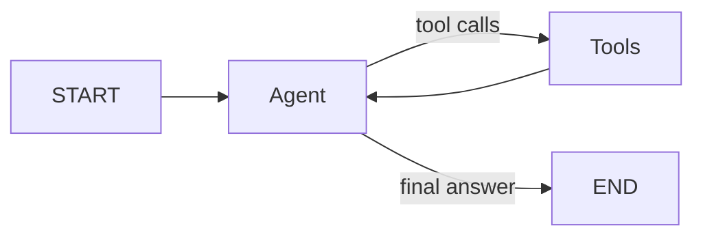

# Chapter 4: Build a ReAct Agent from Scratch

[Watch the visual lesson on YouTube](https://youtu.be/_lj8iYrBRrA)

Chapter 3 built loops without a model. This chapter gives the graph a
deterministic model, tools, and the backward edge that turns tool calling into
a ReAct loop.

This chapter explains:

- what a tool's name, docstring, and argument schema communicate to a model;
- why `bind_tools` prepares tool schemas but does not execute a tool;
- how an `AIMessage.tool_calls` entry represents a request, not a result;
- how the agent node, tool node, router, and backward edge work together;
- how to implement a small `ToolNode` by hand;
- why each `ToolMessage` must carry the matching `tool_call_id`;
- the difference between model stopping, a recursion backstop, and an explicit
  application-level turn budget;
- why a fixed chain cannot express an unknown number of tool calls; and
- how the same loop supports a multi-turn research assistant.

No API key, paid service, or live model call is required. The examples use
`ScriptedModel`, a deterministic stand-in that produces inspectable tool calls.

## Visual model



The model decides whether to request a tool or return a final answer. The graph
owns execution, error handling, routing, and the decision to loop.

## Examples

| File | What it demonstrates |
|---|---|
| [`01_tools.py`](code/01_tools.py) | Tool schemas, `bind_tools`, and inert tool-call requests |
| [`02_the_loop.py`](code/02_the_loop.py) | The agent node, tools node, router, and backward edge |
| [`03_toolnode_by_hand.py`](code/03_toolnode_by_hand.py) | A small hand-written tool executor with correlated results |
| [`04_stopping.py`](code/04_stopping.py) | Model stopping, the recursion backstop, and an explicit turn budget |
| [`05_why_not_a_chain.py`](code/05_why_not_a_chain.py) | A fixed chain compared with a graph that can take a second tool hop |
| [`06_research_agent.py`](code/06_research_agent.py) | A deterministic multi-turn research assistant |
| [`scripted_model.py`](code/scripted_model.py) | The reusable model stand-in used by the chapter |

Run one example:

```bash
python chapters/04-react-agent-from-scratch/code/02_the_loop.py
```

Or run every published example from the repository root:

```bash
python run_examples.py
```

## The core loop

```python
def route_after_agent(state):
    last_message = state["messages"][-1]
    return "tools" if last_message.tool_calls else END

builder.add_conditional_edges("agent", route_after_agent)
builder.add_edge("tools", "agent")
```

The backward edge is what lets the model observe a tool result and decide what
to do next. There is no hard-coded number of turns.

## Stopping note

Use the recursion limit as a safety backstop, not as the user-facing stopping
policy. An explicit budget can return a useful partial result; a recursion
failure only interrupts execution. `04_stopping.py` deliberately drives a tiny
empty loop into a caught `GraphRecursionError` to inspect the installed
version's default limit, so that example can take about a second.

## Scope and reproducibility

- `ScriptedModel` replays a predetermined trace and ignores message meaning. It
  verifies graph orchestration, not model reasoning.
- `03_toolnode_by_hand.py` is a minimal synchronous teaching implementation.
  LangGraph's production `ToolNode` also supports concurrency, async execution,
  injected state and stores, `Command` results, and configurable error handling.
- The hand-written tools node in `06_research_agent.py` executes multiple calls
  sequentially, even though they arrive in one `AIMessage`.
- `05_why_not_a_chain.py` compares the graph with a fixed one-hop pipeline. It
  is not a claim that every program described as a chain is incapable of
  routing.
- The value `10007` is the default observed with LangGraph 1.2.9 when
  `LANGGRAPH_DEFAULT_RECURSION_LIMIT` is unset. Treat the recursion limit as
  version- and environment-specific.
- The scripted research run counts turns for a six-turn safety guard. It ends
  after three turns because the third scripted response contains no tool calls,
  not because the guard fires.

**Key idea:** The model decides what to do. Your graph decides what happens
next.
