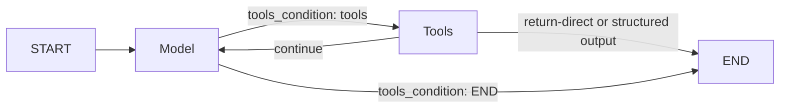

# Chapter 5: Prebuilt Agents and Tool Routing

[Watch the visual lesson on YouTube](https://youtu.be/0xqjQZQw4Q0)

Chapter 4 assembled the ReAct loop by hand. This chapter rebuilds the same
idea with the current `langchain.agents.create_agent` API, then opens the
generated graph so every shortcut remains inspectable.

This chapter explains:

- why `langgraph.prebuilt.create_react_agent` is deprecated and where the
  current agent builder lives;
- how to inspect a generated agent with `get_graph()`;
- where the generated graph differs from the minimal Chapter 4 graph;
- how `ToolNode` handles multiple calls, invalid calls, and tool exceptions;
- how `tools_condition` routes a message list, mapping, or state object;
- how a path map lets the router target a node not named `tools`;
- how middleware provides common model-call and tool-call budgets;
- when custom state, topology, or recovery routing makes a hand-written
  `StateGraph` clearer; and
- how the prebuilt runs the deterministic research-assistant example.

No API key, paid service, or live model call is required. The examples use a
deterministic `ScriptedModel`.

## Visual model



`create_agent` uses a conditional return from the tools node so a return-direct
tool or a structured-output tool can finish immediately. Ordinary tool results
route back to the model. Middleware can also influence control flow.

## Examples

| File | What it demonstrates |
|---|---|
| [`01_one_line.py`](code/01_one_line.py) | The current one-call agent builder and the legacy deprecation warning |
| [`02_what_it_generates.py`](code/02_what_it_generates.py) | Comparing `get_graph()` output with the hand-written graph |
| [`03_toolnode.py`](code/03_toolnode.py) | Multiple calls, invalid calls, tool exceptions, and `handle_tool_errors` |
| [`04_tools_condition.py`](code/04_tools_condition.py) | Router return values, accepted input shapes, `messages_key`, and a path map |
| [`05_when_to_drop_back.py`](code/05_when_to_drop_back.py) | The recursion backstop, middleware limits, and a custom terminal route |
| [`06_research_agent.py`](code/06_research_agent.py) | The research assistant using the prebuilt loop |
| [`scripted_model.py`](code/scripted_model.py) | The deterministic model stand-in used by the chapter |

Run one example:

```bash
python chapters/05-prebuilt-agents/code/02_what_it_generates.py
```

Or run every published example from the repository root:

```bash
python run_examples.py
```

## Current API

```python
from langchain.agents import create_agent

agent = create_agent(model, tools)
```

On the pinned versions, importing
`langgraph.prebuilt.create_react_agent` produces a deprecation warning. New
code should use `langchain.agents.create_agent`.

## Error-policy note

With pinned LangGraph 1.2.9, invoking a `ToolNode` directly without graph
runtime context raises a `ValueError`, so `03_toolnode.py` wraps it in a tiny
graph. The node converts invalid tool names and argument-schema failures into
messages. Exceptions raised inside a tool are re-raised by default; pass
`handle_tool_errors=<callable>` to define a `ToolNode` policy. At the full-agent
level, LangChain middleware such as `ToolErrorMiddleware` or `wrap_tool_call`
can define that policy around tool execution.

## Limits and custom routing

`recursion_limit` is the low-level safety backstop. For common limits,
`ModelCallLimitMiddleware` and `ToolCallLimitMiddleware` can stop or restrict a
prebuilt agent explicitly. Write a custom `StateGraph` when the rule requires
custom state, topology, or a domain-specific recovery route that is clearer as
part of your routing logic.

## Tested environment

- Python 3.14.3
- `langchain==1.3.14`
- `langchain-core==1.5.1`
- `langgraph==1.2.9`
- `langgraph-prebuilt==1.1.0`

Generated graph details and error behavior are version-specific. Use the
repository's pinned requirements when reproducing the output.

**Key idea:** Read what it generates before you rely on what it does.
